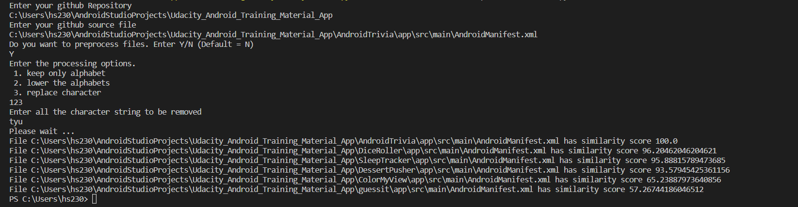

# Duplicate File Finder

## Requirement
- Python 3.10    


## Quick start

- Download main.py, utils.py and squence_matcher.py in one folder
- run main.py
```
python main.py
```
- It will ask to enter Github folder path and source file path
- It will ask to enter Y/N if you want to preprocess the file content.
- In case of Y, it will ask to enter the processing options. 1. keep only alphabet 2. lower the alphabets 3. replace character.
- You can enter any combination of preprocessing option. Example: 12 means preprocessing will keep only alphabet and lower the capital alphabets. In case of 3, you need to enter character that you want to be replaced by empty string.
- It will give output with decreasing order of similarity score until its value is 50%


## Demo result




## Documentation
https://github.com/himanshu230998/duplicate_file_finder/tree/main/documentation
